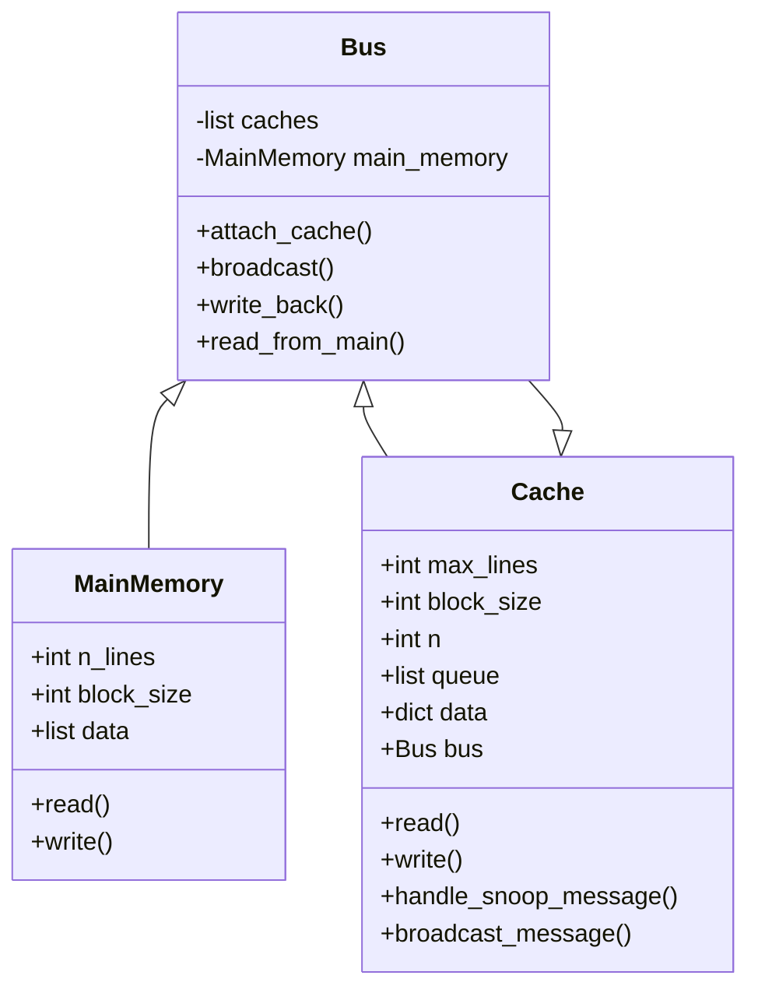

```mermaid
classDiagram
    Bus <|-- MainMemory
    Bus <|-- Cache
    Cache <|-- Bus

    class Bus{
        -list caches
        -MainMemory main_memory

        +attach_cache()
        +broadcast()
        +write_back()
        +read_from_main()
    }

    class MainMemory{
        +int n_lines
        +int block_size
        +list data

        +read()
        +write()
    }

    class Cache{
        +int max_lines
        +int block_size
        +int n
        +list queue
        +dict data
        +Bus bus

        +read()
        +write()
        +handle_snoop_message()
        +broadcast_message()
    }
```
